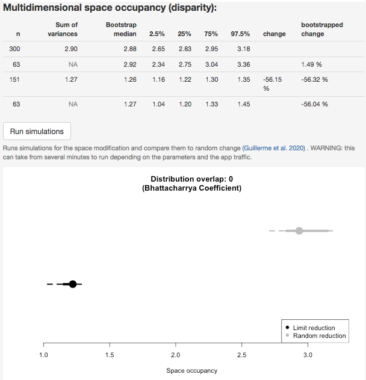

## Introduction

`moms` is a Shiny app for helping choosing the right tool for measuring occupancy in multidimensional spaces.

**Multdimensional spaces** are any space with multiple dimensions as columns (usually -but not necessary - more than 3 dimensions) and observations (or elements) as rows.
Such multidimensional spaces are called differently in different fields in biology (and beyond) but they are often trait-spaces in ecology or morphospaces in macroevolution.

**Space-occupancy metrics** are indices that measure how the observations (data points) are distributed in the trait-space.
They also have different names in different fields, they have been called dissimilarity indices (ecology) or disparity metrics (evolution).

One problem is that these space-occupancy metrics can be non-intuitive, especially in high dimensional spaces and can capture different aspects of space-occupancy (volume, density or position).
`moms` allow to simulate or import multidimensional spaces and test and visualise the effect of specific metrics on the multidimensional space occupancy.
It also allows to disrupt the space to check how the metric responds to changes in the distribution of the observations.

### What `moms` is?

`moms` is a tool for helping to analyse multidimensional data.
There are probably as many metrics as they are trait-spaces out there so it can be difficult to chose which metric to use to measure changes or differences in your own trait space.
`moms` is designed to help you in this task by visualising and playing around with different metrics and different scenarios.
For example, if one measures the sum of the variance of each dimension, how does this metric change when the volume in the trait-space is reduced by 50%? Does it reduce by 50%? Well that of course depends on many parameters that you can explore in `moms`.

### What `moms` is *not*?

A tool for analysing multidimensional data.
`moms` is a tool for helping to choose multidimensional space occupancy metrics, it should not be used to actually analyse the spaces.
If you want to analyse multidimensional spaces, we suggest you use the many `R` packages available: [`dispRity`](https://cran.r-project.org/web/packages/dispRity/index.html), [`vegan`](https://cran.r-project.org/web/packages/vegan/index.html) or [`Momocs`](https://cran.r-project.org/web/packages/Momocs/index.html) or whatever tools suits you best!

## The basics {#basics}

This is what `moms` looks like:


There are six panels (that can change in size and content!):

1. The space generation panel (upper left): to generate or load your trait-space 
2. The space modification panel (lower left): to modify (reduce) your trait-space
3. The space panel (centre up): the visualisation of a 2D image of your space
4. The metric panel (upper right): to chose how to measure space occupancy
5. The occupancy panel (centre down): the amount of space occupancy
6. The display panel (upper left): to chose how to visualise the 2D image of your space

The basic `moms` pipeline would probably go as follow:

 * Generate or import a multidimensional space: in the example above a 2D uniform uncorrelated space with 1000 elements;
 * Apply a modification to the space: in the example above remove 33% of the elements from the centre;
 * Calculate a space-occupancy metric: in the example above the sum of the variances of each dimensions;
 * Comparing the metric between the full and reduced spaces: in the example above, removing 33% of the elements in the centre increases the sum of variances by 33%.

It is then possible to explore either the effect of the space modification on different metrics by changing the metric (until you find the one that suits your question) or by changing the space modification (until you find what type of space modification the metric measures, or not).

### Creating a space {#createspace}

The easiest way is to let `moms` create a space for you you can chose the number of dimensions and the number of observations using the sliders.
You can do this using the `"User"` option in the space generation [panel (1)](#basics):


This panel allows to select:

1. The **number of observations** (simulating the number of species, field sites, etc...).
2. The **number of dimensions** (the number of traits).
3. The **distribution** of traits see this [specific section](#traits_distributions) for more info.
4. The **dimensions variance** to specify how much variance should be on each dimensions.
This can be done to simulate principal components analysis (PCA) for example where the distribution of variance per dimensions tends to decrease log-normally.
5. The **dimensions correlation** allowing to set some correlation between the distributions.
This can be done by inputting a vector of correlations between each distributions, filling a correlation matrix or uploading a personalised correlation matrix. 

You can visualise the resulting space in the [space panel (3)](#basics).

> **Importing spaces**: Note that you can also import your own space using `"Input"` in the "Select the type of space to use type" menu.
This will open a navigation window allowing you to select a `.csv` matrix on your machine.
The matrix must contain only numeric values and must have row and column names.

> **Using demo spaces**:Finally it is also possible to use demo data by selecting `"Demo"` in the "Select the type of space to use type" menu.
You can then choose across six diverse published empirical multidimensional spaces from ranging from palaeontology to ecology.
Information about the empirical multidimensional spaces is displayed once you select any (i.e. what is the space capturing?) along with the reference of the original publication for more informations.

#### Trait distributions {#traits_distributions}

The traits can be `"Normal"`, `"LogNormal"`, `"Uniform"`, `"Gamma"`, `"Poisson"` or `"Specific"`.
For each of these option (expect `"Specific"`), it is possible to set the distribution parameters (e.g. the mean and the standard deviation for a normal distribution).
When using the `"Specific"` option, you can input different specific distributions as random distribution functions from the `stats` package in `R`.
For example, if you want a five dimensional space with two normal traits, two uniform ones and one gamma, you can use the following `"Specific"` option:

```
list(rnorm, rnorm, runif, runif, rgamma)
```

Note that you can fine tune each of these distribution by giving them specific parameters by ticking the `"Optional arguments"` button and enter a list of arguments. Use an empty list (`list()`) for empty (default) arguments.
For the example above, if we want all the distributions to be default but the uniform ones to be bounded between -1 and 1, we can use:

```
list(list(), list(), list(max = 1, min = -1), list(max = 1, min = -1), list())
```

Note that the order of the arguments does not matter as long as they are named.
To check the available arguments, refer to the specific function in the `R` manual (e.g. `?rpoisson`).

### Modifying the space

Once a space is parametrised (or imported), it is possible to modify it by selecting a modification algorithm in the "Space modification" menu.


Four modifications are implemented:

* **Random:** to remove a random proportion of elements.

* **Limit:** by removing all elements with a distance from the centre (mean point) of the space lower or greater than a radius $\rho$ (where \$rho$ is selected such that the desired proportion of elements are selected).

* **Displace:** by removing points similarly as above but using the distance from the furthest point from the centre.

* **Density:** by removing any pairs of point with a distance $D$ from each other where (where $D$ is selected such that the desired proportion of elements are selected).

For each removal algorithm, you can choose the proportion of elements to remove using the "Proportion to remove" sliding bar (between 10% and 90%).
It is also possible to use the "Inverse removal" button to inverse the selection: for example if you randomly remove 33% of the elements, ticking this option will keep the 33% selected elements (i.e. remove 66% others).

> If you are using the demo datasets, you can also choose to select the groupings used for the demo datasets which will automatically generate empirical groups. Details on the groups is given when ticking this option.

You can visualise the resulting modification in the [space panel (3)](#basics).

### Measuring space occupancy

You can then select which space occupancy metric to apply to the global space and its modification in the [metric panel (4)](#basics).
This panel is also called "Disparity" since this is the term mostly used in palaeobiology.
It can be referred to as "Dissimilarity" in ecology or as space occupancy in general.

")

This panel allows you to choose a space occupancy metric across three categories of commonly used space occupancy metrics (by selecting `"Volume"`, `"Density"` or `"Position"` in `"Metric type"` and the appropriate metric).
You can also input your own personalised metric by selecting `"User"` in `"Metric type"`.
This option gives you various choices between Dimension level 1 metrics and Dimensions level 2 metrics.
The Dimensions level of a metric is reflecting the dimensionality level of the transformation of a matrix using this metric.
For example, the arithmetic mean (`mean`) transforms a matrix (dimension level 3) into a single value (dimension level 1 - see Figure 5).


This allows you to combine different metrics, for example, the sum (dimension level 1) of the variances of each column of the matrix (dimension level 2).

You can also visualise the metric's code by ticking the `"show metric code"` box and even modify it by selecting `"edit"` metric!
For example in Figure 4, the sum of variances is edited to be the sum of variances divided by 10.
You can modify metrics by using the `R` synthax and any functions from the `stats` or `dispRity` package.

You can visualise the metric values in the [space occupancy panel (5)](#basics).

#### Sampling {#sampling}

It is also possible to look at the effect of sampling by ticking the `"Change sampling (rarefaction)"` box.
This will display a slider allowing you to select the number of elements you want to sample for the overall space or for the reduced space.
The sampling uses the bootstrap procedure from the `dispRity::boot.matrix()` function and allows to reduce the number of elements by performing 100 bootstraps and resampling `n` elements each time (from the sampling proportion value on the slider).
Note that the proportion of elements sampled is determined by the size of the reduced subset.
For example in a multidimensional space with 300 elements and a randomly reduced subset including 50% of elements (150), 100% sampling corresponds to 150 elements, 50% sampling to 75 elements, etc...

### Results and simulations

Once all the options carefully selected to correspond to your analysis and biological question, you can see the resulting displays in the [result panel (5)](#basics).



By default, this panel displays the space occupancy measure (depending on the chosen metric) for the full space and for the reduced space.
It also shows the proportional difference between the full space and the reduced one (ideally you'd want this value to decrease proportionally to the elements removed!).
If using the [sampling option](#sampling), the results also display the median bootstrap value for the subsets with all elements (third column first and third row in Fig 6.), the median bootstrapped values for the rarefied samples (the one with less elements: third column first and third row in Fig. 6) and the 95% and 50% confidence intervals for these estimations.
The table also displays the proportional effect of sampling compared to the full dataset in the last column.
Ideally you want these values to be close to 0 for the full dataset and close to the proportional change for the reduced subset.

#### Simulations

It is also possible, when parametrising a user input space ([see space section above](#createspace)), to simulate how does your chosen space occupancy metric compares in a selected reduced space to a random one.
This option can take several minutes to run depending on the shiny apps sever traffic (or your machine if you're running the locally).
The results will are displayed in a graph and show the proportion of overlap between the space occupancy in the reduced space (bottom in Fig. 6) and the ones from a random removal (top in Fig. 6).
The more these distributions overlap (measured by the Bhattacharrya Coefficient), the more likely your metric will pick up random signal rather than the real signal from your reduction. 

### Changing the display

Finally, you can modify the display of [space panel (3)](#basics) by using the [display panel (6)](#basics).
This one allows to select which axis (dimensions) to be displayed, what colour palette to use and finally whether to scale the axis or not.
This latest option can be useful when dimensions don't have the same variance.

## `moms` and `dispRity`

`moms` is based on the [`dispRity`](https://cran.r-project.org/web/packages/dispRity/index.html) package.
You can find every space occupancy metrics in the `dispRity` package by looking for the `?dispRity::dispRity.metric` manual.
The simulated spaces on the other hand are generated using the `?dispRity::space.maker` function.
You can find much more information about both sets of functions in the [`dispRity` manual](https://tguillerme.github.io/dispRity.html).
